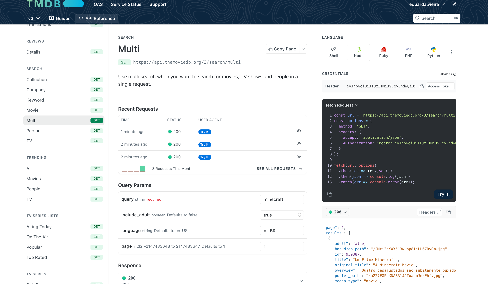
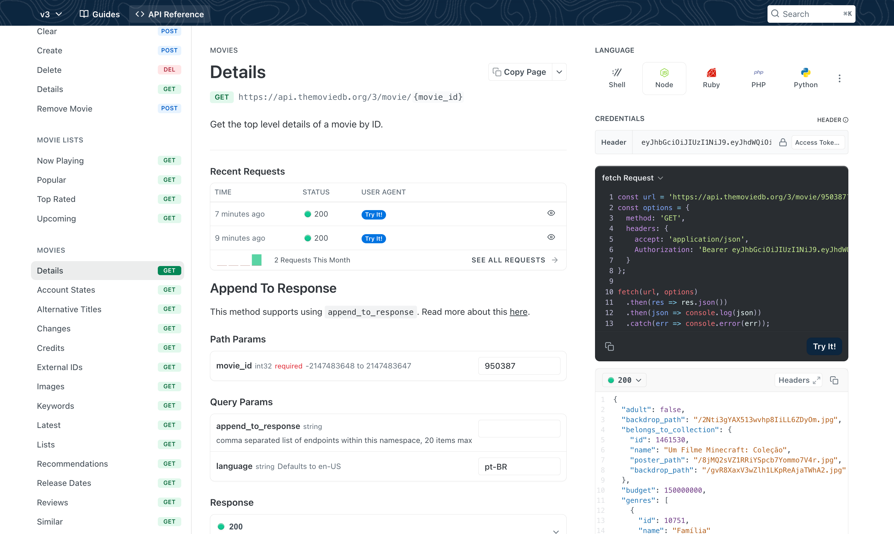

## API do The Movie DB

Guia rápido para testar rotas da API do TMDB.

### 1. Testar a rota no site oficial

- [Search Multi](https://developer.themoviedb.org/reference/search-multi)


---
### 2. Exemplo de busca

- Pesquisar por **Minecraft**
- ID encontrado: `950387`

- [Movie Details](https://developer.themoviedb.org/reference/movie-details)


---
### 3. Testar no navegador

```text
https://api.themoviedb.org/3/movie/popular?api_key=SUA_CHAVE
```